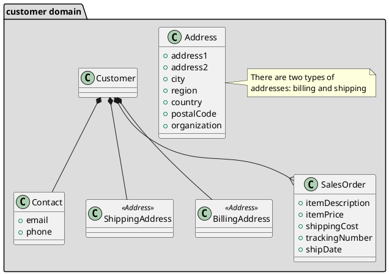

## uml: class diagram

## https://www.freecodecamp.org/news/inserting-uml-in-markdown-using-vscode/amp/

```plantuml
@startuml
package "customer domain" #DDDDDD {
    class Contact {
        + email
        + phone
    }

    class Address {
        + address1
        + address2
        + city
        + region
        + country
        + postalCode
        + organization
    }

    note right of Address
        There are two types of
        addresses: billing and shipping
    end note

    class Customer {
    }

    Customer *-- Contact
    Customer *-- ShippingAddress
    Customer *-- BillingAddress
    Customer *--{ SalesOrder

    class ShippingAddress <<Address>>
    class BillingAddress <<Address>>
    class SalesOrder {
        + itemDescription
        + itemPrice
        + shippingCost
        + trackingNumber
        + shipDate
    }
}
@enduml
```
